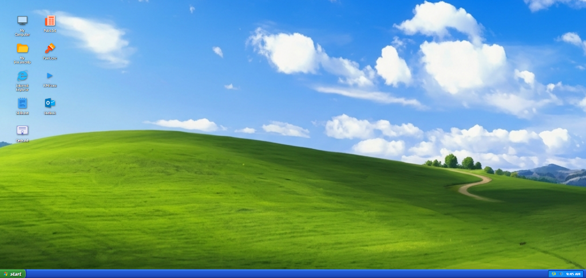

# 🖥️ Windows XP Theme Interactive CV / Portfolio

A highly polished, interactive, and nostalgia-inducing retro Windows XP desktop environment styled portfolio. Built using **Python (Flask)** on the backend and vanilla **HTML, CSS, and JavaScript** on the frontend. 



It dynamically loads all professional profile details (About me, experience, education, projects, skills, certifications, and publications) from a simple, easily editable JSON configuration file.

---

## ✨ Features

- **Iconic Bliss Background**: A premium high-resolution replication of the legendary green hills wallpaper.
- **Draggable & Active Windows**: Full windowing system allowing you to drag, minimize, maximize, and close classic blue Luna-themed windows.
- **Dynamic Taskbar & System Clock**: An active taskbar showing open programs, active states, system tray tools, and a real-time updating clock.
- **Interactive Start Menu**: A 2-column Start Menu providing profile summary, custom program links, and dynamic shutdown/reboot controls.
- **Fully Integrated Classic Apps**:
  - **MS Paint.exe**: Draw on a canvas with a selection of colors and clear/erase options.
  - **WMP.exe (Windows Media Player)**: Mockup audio visualizer with play/pause state and simulated rhythmic audio chimes.
  - **Notepad.txt**: View dynamic text documents representing **Skills**, **Certifications**, and **Publications**.
  - **Internet Explorer**: Browse featured projects in a mock browser window.
  - **Outlook Express**: Replaces standard guestbooks with an email composer that automatically pre-fills a direct client-side draft to the developer.
- **Nostalgic Audio Engine**: Authentic Windows XP system sounds (Startup chime, error beep, click ticks, standby indicators) powered by the Web Audio API (unlocked on first user interaction).
- **Standby Starfield Screensaver**: Triggering "Standby" starts a 3D perspective starfield animation with customized drifting logo text. Click anywhere to reboot!
- **Tracked Security Phone Reveal**: Encrypts and hides phone numbers from web crawlers, revealing it only on user click while logging the reveal count in a local stats counter.

---

## 🛠️ Tech Stack

- **Backend**: Python, Flask
- **Frontend**: HTML5, Vanilla CSS3, Javascript (ES6)
- **Data Model**: JSON (`cv_data.json`)
- **Assets**: Icons8 free color library, Web Audio API synthesizers

---

## 🚀 Quick Start

### 1. Requirements
Ensure you have **Python 3** installed.

### 2. Install Dependencies
Install Flask using the requirement file:
```bash
pip install -r requirements.txt
```

### 3. Run the Server
Launch the Flask development server:
```bash
python app.py
```

### 4. Open in Browser
Visit **[http://127.0.0.1:5000](http://127.0.0.1:5000)** to explore your retro Windows XP portfolio!

---

## 📝 Customizing Your CV

To make this portfolio your own:
1. Open the [cv_data.json](cv_data.json) file in the root directory.
2. Edit the professional profile fields (name, title, bio, education, jobs, skills, and projects) to reflect your career history.
3. Save the file. The Flask backend will hot-reload the data dynamically without any server restarts!
4. Check out [cv_data_template.json](cv_data_template.json) for a clean schema blueprint.

---

## 📄 License
This project is open-source and free to adapt. Enjoy the classic computing nostalgia!
